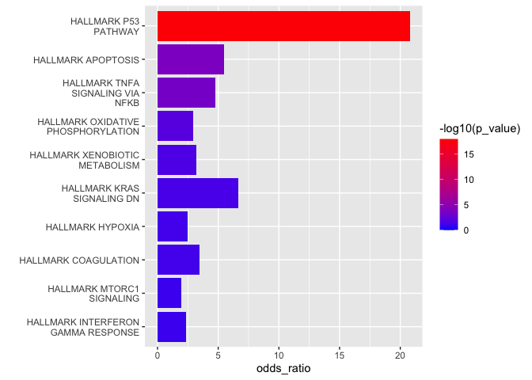
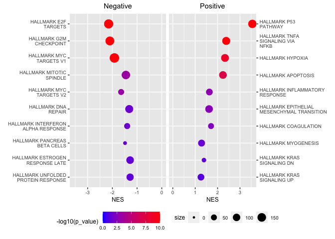

cdsrgsea
================

cdsrgsea contains lightweight wrappers around useful gene set enrichment
functions

## Install

``` r
library(devtools)
devtools::install_github("broadinstitute/cdsr_gsea")
```

The package can then be loaded by calling

``` r
library(cdsrgsea)
```

## load\_gene\_sets

Loads a list of gene sets in term2gene format from taiga. These gene
sets are drawn from the
[Enrichr](https://amp.pharm.mssm.edu/Enrichr/#stats) and
[MSigDB](https://www.gsea-msigdb.org/gsea/msigdb/index.jsp)
    libraries.

``` r
gene_sets <- cdsrgsea::load_gene_sets()
```

``` r
gene_sets %>% names() %>% head()
```

    ## [1] "BioCarta"       "BioPlanet"      "BioPlex"        "Cancer_Modules"
    ## [5] "Canonical"      "ChEA"

``` r
gene_sets$Hallmark %>% head()
```

    ## # A tibble: 6 x 2
    ##   term                             gene   
    ##   <chr>                            <chr>  
    ## 1 HALLMARK_TNFA_SIGNALING_VIA_NFKB JUNB   
    ## 2 HALLMARK_TNFA_SIGNALING_VIA_NFKB CXCL2  
    ## 3 HALLMARK_TNFA_SIGNALING_VIA_NFKB ATF3   
    ## 4 HALLMARK_TNFA_SIGNALING_VIA_NFKB NFKBIA 
    ## 5 HALLMARK_TNFA_SIGNALING_VIA_NFKB TNFAIP3
    ## 6 HALLMARK_TNFA_SIGNALING_VIA_NFKB PTGS2

## run\_hyper

`run_hyper` runs overrepresentation analysis based on the hypergeometric
distribution. The function excepts either a small list of significant
genes or a table with gene level stats as input. If a table is provided
the `gene_var`, `rank_var`, and `n_genes` parameters are used to define
a small list of significant genes.

As an example we will load the results of a differential expression
anlyses comparing Nutlin treated cells to DMSO treated cells.

``` r
nutlin <- read_csv("./nutlin.csv")
nutlin %>% head()
```

    ## # A tibble: 6 x 3
    ##   Gene   logFC `-log10(p-value)`
    ##   <chr>  <dbl>             <dbl>
    ## 1 CDKN1A 1.31              166. 
    ## 2 MDM2   0.994             154. 
    ## 3 GDF15  0.977             145. 
    ## 4 SUGCT  0.708             139. 
    ## 5 RPS27  0.366              96.4
    ## 6 FDXR   0.679              96.0

1.  Small list of significant genes

<!-- end list -->

``` r
genes <- nutlin %>% arrange(-logFC) %>% head(100) %>% .[["Gene"]]
genes %>% head()
```

    ## [1] "CDKN1A" "MDM2"   "GDF15"  "TP53I3" "SUGCT"  "FDXR"

``` r
hyper_res <- cdsrgsea::run_hyper(genes,gene_sets$Hallmark,universe = nutlin$Gene)
hyper_res
```

    ## # A tibble: 50 x 8
    ##    term         p_value p_adjust odds_ratio direction  size overlap_size overlap
    ##    <chr>          <dbl>    <dbl>      <dbl> <lgl>     <int>        <int> <list> 
    ##  1 HALLMARK_P… 1.16e-18 5.79e-17      20.8  NA          142           24 <chr […
    ##  2 HALLMARK_K… 4.49e- 2 3.74e- 1       6.68 NA           18            2 <chr […
    ##  3 HALLMARK_A… 1.53e- 4 3.82e- 3       5.51 NA          109            9 <chr […
    ##  4 HALLMARK_T… 4.10e- 4 6.84e- 3       4.76 NA          124            9 <chr […
    ##  5 HALLMARK_C… 6.82e- 2 4.26e- 1       3.44 NA           50            3 <chr […
    ##  6 HALLMARK_X… 2.89e- 2 2.89e- 1       3.19 NA           92            5 <chr […
    ##  7 HALLMARK_O… 1.16e- 2 1.45e- 1       2.94 NA          166            8 <chr […
    ##  8 HALLMARK_H… 6.71e- 2 4.26e- 1       2.48 NA          116            5 <chr […
    ##  9 HALLMARK_P… 1.47e- 1 5.83e- 1       2.39 NA           70            3 <chr […
    ## 10 HALLMARK_A… 1.52e- 1 5.83e- 1       2.36 NA           71            3 <chr […
    ## # … with 40 more rows

2.  A table with gene level
stats

<!-- end list -->

``` r
hyper_res <- cdsrgsea::run_hyper(nutlin,gene_sets$Hallmark,gene_var = "Gene",
                                 rank_var = "logFC",dir = "pos",n_genes = 100)
hyper_res
```

    ## # A tibble: 50 x 8
    ##    term         p_value p_adjust odds_ratio direction  size overlap_size overlap
    ##    <chr>          <dbl>    <dbl>      <dbl> <chr>     <int>        <int> <list> 
    ##  1 HALLMARK_P… 1.16e-18 5.79e-17      20.8  pos         142           24 <chr […
    ##  2 HALLMARK_K… 4.49e- 2 3.74e- 1       6.68 pos          18            2 <chr […
    ##  3 HALLMARK_A… 1.53e- 4 3.82e- 3       5.51 pos         109            9 <chr […
    ##  4 HALLMARK_T… 4.10e- 4 6.84e- 3       4.76 pos         124            9 <chr […
    ##  5 HALLMARK_C… 6.82e- 2 4.26e- 1       3.44 pos          50            3 <chr […
    ##  6 HALLMARK_X… 2.89e- 2 2.89e- 1       3.19 pos          92            5 <chr […
    ##  7 HALLMARK_O… 1.16e- 2 1.45e- 1       2.94 pos         166            8 <chr […
    ##  8 HALLMARK_H… 6.71e- 2 4.26e- 1       2.48 pos         116            5 <chr […
    ##  9 HALLMARK_P… 1.47e- 1 5.83e- 1       2.39 pos          70            3 <chr […
    ## 10 HALLMARK_A… 1.52e- 1 5.83e- 1       2.36 pos          71            3 <chr […
    ## # … with 40 more rows

## run\_gsea

`run_gsea` runs gene set enrichment analysis using the `fgseaMultilevel`
method from the `fgsea` package. The function excepts a table with gene
level stats. The `dir` parameter indicates whether to return positive
gene sets, negative gene sets, or
both.

``` r
gsea_res <- cdsrgsea::run_gsea(nutlin,gene_sets$Hallmark,gene_var = "Gene",
                               rank_var = "logFC",dir = "both")
gsea_res
```

    ## # A tibble: 50 x 8
    ##    term              p_value  p_adjust     ES   NES direction  size leading_edge
    ##    <chr>               <dbl>     <dbl>  <dbl> <dbl> <chr>     <int> <list>      
    ##  1 HALLMARK_P53_PA… 1.00e-10   1.02e-9  0.672  3.55 pos         142 <chr [70]>  
    ##  2 HALLMARK_TNFA_S… 1.02e-10   1.02e-9  0.467  2.38 pos         124 <chr [53]>  
    ##  3 HALLMARK_HYPOXIA 1.80e- 9   1.50e-8  0.450  2.33 pos         116 <chr [28]>  
    ##  4 HALLMARK_APOPTO… 7.02e- 8   5.01e-7  0.416  2.24 pos         109 <chr [30]>  
    ##  5 HALLMARK_E2F_TA… 1.00e-10   1.02e-9 -0.646 -2.15 neg         179 <chr [118]> 
    ##  6 HALLMARK_G2M_CH… 1.00e-10   1.02e-9 -0.634 -2.10 neg         163 <chr [88]>  
    ##  7 HALLMARK_MYC_TA… 1.00e-10   1.02e-9 -0.574 -1.92 neg         196 <chr [93]>  
    ##  8 HALLMARK_COAGUL… 4.69e- 3   1.95e-2  0.383  1.71 pos          50 <chr [14]>  
    ##  9 HALLMARK_MYC_TA… 6.24e- 4   3.47e-3 -0.548 -1.64 neg          51 <chr [25]>  
    ## 10 HALLMARK_INFLAM… 1.92e- 3   9.62e-3  0.337  1.63 pos          74 <chr [14]>  
    ## # … with 40 more rows

## Plot results

This package is designed to be used with the plotting functions in
[cdsr\_plots](https://github.com/broadinstitute/cdsr_plots)

`make_gsea_bar`

``` r
cdsrplots::make_gsea_bar(hyper_res,dir = "pos")
```

<!-- -->

`make_gsea_dot`

``` r
cdsrplots::make_gsea_dot(gsea_res,dir = "both")
```

<!-- -->
